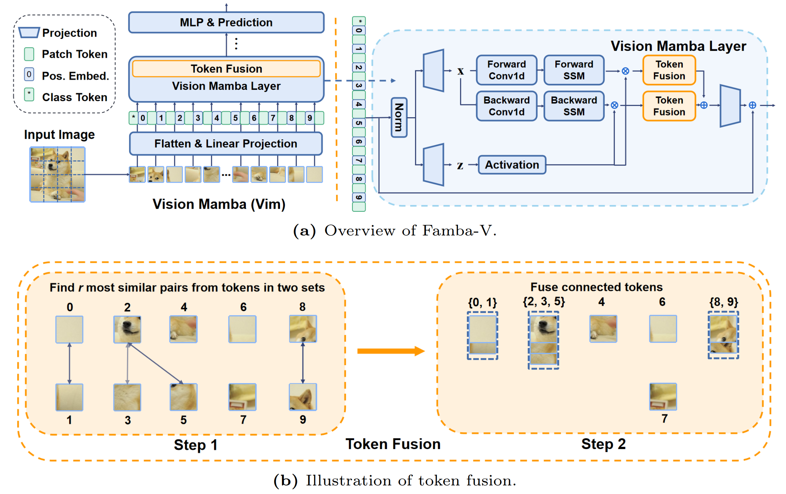

<div align="center">
<h1>Famba-V</h1>
<h3>Fast Vision Mamba with Sparse Fusion-based Visual Representation</h3>

[Hui Shen](https://scholar.google.com/citations?view_op=list_works&hl=en&hl=en&user=iblw0zoAAAAJ), [Zhongwei Wan](https://github.com/LegendBC)<sup>:email:</sup>, [Xin Wang](https://scholar.google.com/citations?user=pCY-bikAAAAJ&hl=zh-CN), [Mi Zhang](https://xwcv.github.io/)<sup>:email:</sup>

The Ohio State University

(<sup>:email:</sup>) corresponding author.

Paper Link ([]())


</div>


#


## Abstract
Visual representation learning has seen significant advancements with the emergence of Transformer-based architectures. However, their quadratic complexity poses efficiency challenges. This work introduces Faster Mamba for Vision (Famba-V), a pioneering approach for feature sparse fusion in State Space Models (SSMs), specifically designed for Vision Mamba (Vim) models. Unlike token pruning techniques, Famba-V leverages cosine similarity between tokens to identify and merge similar information without information loss. Our critical observation is that the most similar tokens in the lower layers of the Vim model are highly structured within several regions, which we call Sparse Groups. This phenomenon indicates that sparse fusion in the lower layers may result in a loss of visual information due to the linear nature of SSM. Extensive experiments on CIFAR-100 datasets demonstrate that Famba-V achieves up to 20\% training time reduction and 26\%-28\% memory usage reduction with different model sizes compared to vanilla Vim with minimal accuracy drop. This work not only introduces the first visual token sparse fusion technique for Vim models but also explores effective strategies for handling the lower layer sparse groups. Our results highlight a promising new direction in SSM compression techniques, offering an alternative to feature pruning methods while maintaining or enhancing performance in image classification tasks.


<div align="center">

</div>

## Overview
<div align="center">

</div>

## Envs. for Pretraining

- Python 3.10.13

  - `conda create -n your_env_name python=3.10.13`

- torch 2.1.1 + cu118
  - `pip install torch==2.1.1 torchvision==0.16.1 torchaudio==2.1.1 --index-url https://download.pytorch.org/whl/cu118`

- Requirements: vim_requirements.txt
  - `pip install -r fambav/vim_requirements.txt`

- Install ``causal_conv1d`` and ``mamba``
  - `pip install -e causal_conv1d>=1.1.0`
  - `pip install -e mamba-1p1p1`
  
  

## Train Your Famba-V with Upper-layer Fusion Strategy
```bash
CUDA_VISIBLE_DEVICES=0 python -m torch.distributed.launch --nproc_per_node=1 --use_env main.py --model vim_tiny_patch16_224_bimambav2_final_pool_mean_abs_pos_embed_with_midclstok_div2 --batch-size 128 --drop-path 0.0 --weight-decay 0.1 --num_workers 25 --data-set CIFAR --data-path ./datasets/cifar-100-python --output_dir ./output/vim_tiny_patch16_224_bimambav2_final_pool_mean_abs_pos_embed_with_midclstok_div2 --no_amp --fusion-strategy upper --fusion-layer 4 --fusion-token 8
```
## Acknowledgement :heart:
This project is based on Vision Mamba ([paper](https://arxiv.org/abs/2401.09417), [code](https://github.com/hustvl/Vim?tab=readme-ov-file)), Mamba ([paper](https://arxiv.org/abs/2312.00752), [code](https://github.com/state-spaces/mamba)), Causal-Conv1d ([code](https://github.com/Dao-AILab/causal-conv1d)), DeiT ([paper](https://arxiv.org/abs/2012.12877), [code](https://github.com/facebookresearch/deit)). Thanks for their wonderful works.

## Citation
If you find Famba-V is useful in your research or applications, please consider giving us a star 🌟 and citing it by the following BibTeX entry.

```bibtex

```
